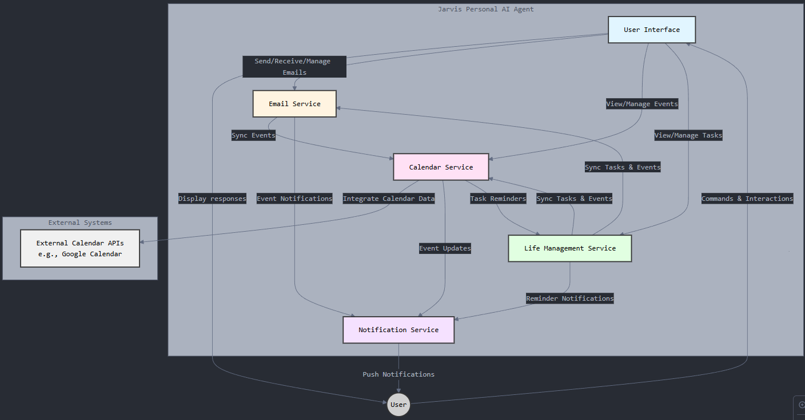

## Application Architecture

The architecture of Jarvis consists of several microservices that handle different functionalities. or a detailed overview, please refere to the [architecture document](docs/architecture.md) abd the component diagram below:

This modular design allows for easier maintenance and scalability as the application grows.

## Email Processing

### Fetching Emails
To fetch emails, send a GET request to `\fetch-emails` with the user's email and password in the request body. This will return the emails for the user's inbox.

### Sending Emails
To send emails, you can use the `sendEmail` function form the email processing module. Provide the necessary SMTP configuration and email details such as suchject, body, ect.

### Generating Email Responses
To generate a response for an email, send a POST request to `/generate-response` with the email content in the request body. This will return a draft response based on the input email content.

### Notifications
Notifications are for due bills, or upcoming subscription renewals are sent via email. Ensure your email configureation is set up correctly in the application.

### Setting Up CI/CD
1. **Workflow File**: The CI/CD pipeline is defined in the `.github/workflows/ci.yml` file. This file specifies the steps to check out th code, set up the Node.js environment, install dependencies, run tests, and deploy the application.
2. **Monitoring the pipeline**: After puching changes to the `main` branch, you can monitor the pipeline's status by navigating to the 'Actions' tab in your Github repository. Here, you can see the progress of each job and view logs for debugging if necessary.